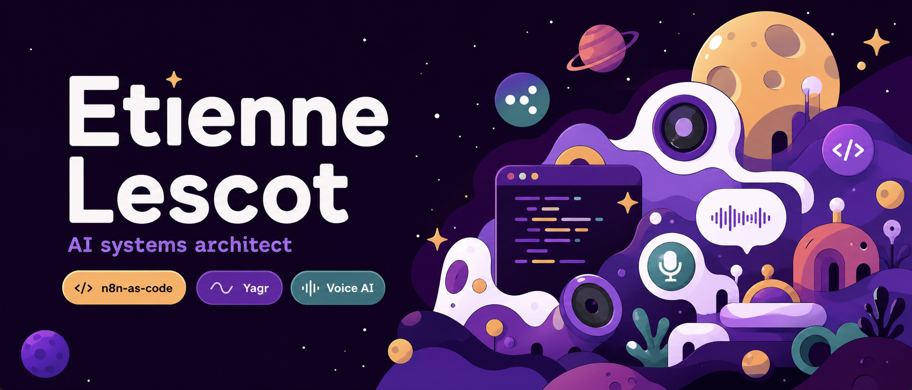

<picture>
  
</picture>

# Etienne Lescot

I build the infrastructure layer for agentic software: code-first workflow automation, grounded agents, and realtime voice systems.

15+ years shipping SaaS, IoT, product platforms, and cloud infrastructure. Now focused on open-source AI tooling that agents and humans can both read, change, test, and operate.

## Current work

| Project | What it is for |
| --- | --- |
| [n8n-as-code](https://github.com/EtienneLescot/n8n-as-code) | Git-native workflow development for n8n: full node schemas, typed workflows, template discovery, and agent-friendly automation tooling. |
| [YAGR](https://github.com/EtienneLescot/yagr) | Experiments around grounded agents, runtime context, and making AI systems less detached from operational reality. |
| [Agent Fabric](https://github.com/EtienneLescot/agent-fabric) | Notes and architecture patterns for the contracts emerging across modern coding agents. |
| [openclaw-stimm-voice](https://github.com/EtienneLescot/openclaw-stimm-voice) | Realtime voice conversations as a plugin layer: low-latency UX, WebRTC constraints, and agent interfaces. |

## Direction

- Agentic automation that behaves like software, not screenshots.
- Workflow platforms with schemas, diffs, review, CI, and deployability.
- Grounded AI agents with explicit runtime contracts.
- Realtime voice systems that feel interruptible, useful, and production-ready.

## Operating range

`Agentic systems` `MCP` `Agent skills` `Workflow orchestration` `Realtime AI interfaces` `Cloud-native platforms` `Developer experience` `Open-source infrastructure`

## Contact

[LinkedIn](https://www.linkedin.com/in/etienne-lescot-69402019/) · [GitHub](https://github.com/EtienneLescot)
